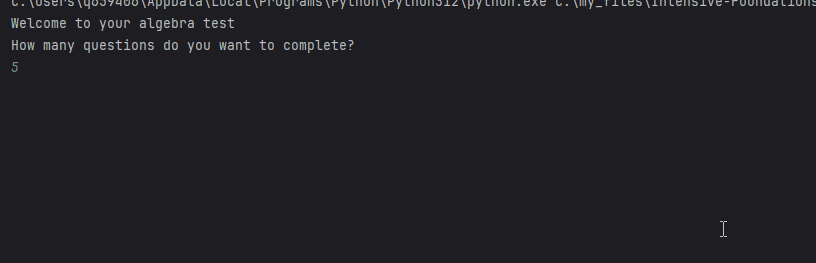
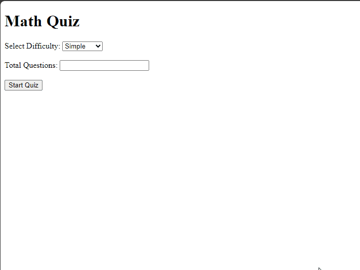

# Maths Question Generator

This program aims to generate equations for the user to solve and can be used via the command line or the web GUI by running the Flask application. 

# Navigation
[User Guide](https://github.com/au-NU/Intensive-Foundations-CS-Programming-Coursework-1/blob/master/README.md#user-guide)

[Features](https://github.com/au-NU/Intensive-Foundations-CS-Programming-Coursework-1/blob/master/README.md#features)

[What You'll Need](https://github.com/au-NU/Intensive-Foundations-CS-Programming-Coursework-1/blob/master/README.md#what-youll-need)

[How to get started](https://github.com/au-NU/Intensive-Foundations-CS-Programming-Coursework-1/blob/master/README.md#how-to-get-started)

[Command line version](https://github.com/au-NU/Intensive-Foundations-CS-Programming-Coursework-1/blob/master/README.md#command-line-version)

[Flask Web Application version](https://github.com/au-NU/Intensive-Foundations-CS-Programming-Coursework-1/blob/master/README.md#flask-web-application-version)


## User Guide

There are two difficulties - simple and quadratic, for the user to select from. Simple questions are presented in the form: $3x + 12 = 18$ while quadratics are generated in the form $ax^2 + bx + c = 0$. The aim is to solve the questions and input the numbers into the box.

## Features

- Choose the number of questions to complete
- Choose the desired difficulty
- Enter answers into the input box to receive instant feedback
- Can practice for as long as you want without needing to re-enter the program in the Web GUI

## What You'll Need

- Python 3 environment
- Access to a command line to be able to use the command line interface

## How to get started

    1. Select your difficulty
    2. Enter the number of questions you want to complete by typing or clicking the up arrow
    3. Press "Start quiz"
    4. Enter your answers
    5. Press submit when finished to be graded

## Command line version
### Example Gameplay

```
Welcome to your algebra test
How many questions do you want to complete?
5
Choose from the following difficulties:
	1)Simple equations
	2)Quadratic equations
1
Q1: -4 * x = 80
What is the value of x?
```

### How to run


Type in to the command line to continue

### Demo


## Flask Web Application version
### Example Gameplay in Flask web application


### How to run


Once you have run the 'app.py' file, navigate to the displayed URL (usually http://127.0.0.1:5000/) to navigate to the server where the page is hosted, and continue on the webpage.

### Demo

## Run Locally

Clone the project

```bash
  git clone https://github.com/au-NU/Intensive-Foundations-CS-Programming-Coursework-1
```
 Use task_1.py for the command line version

 Use app.py for the Flask application version


